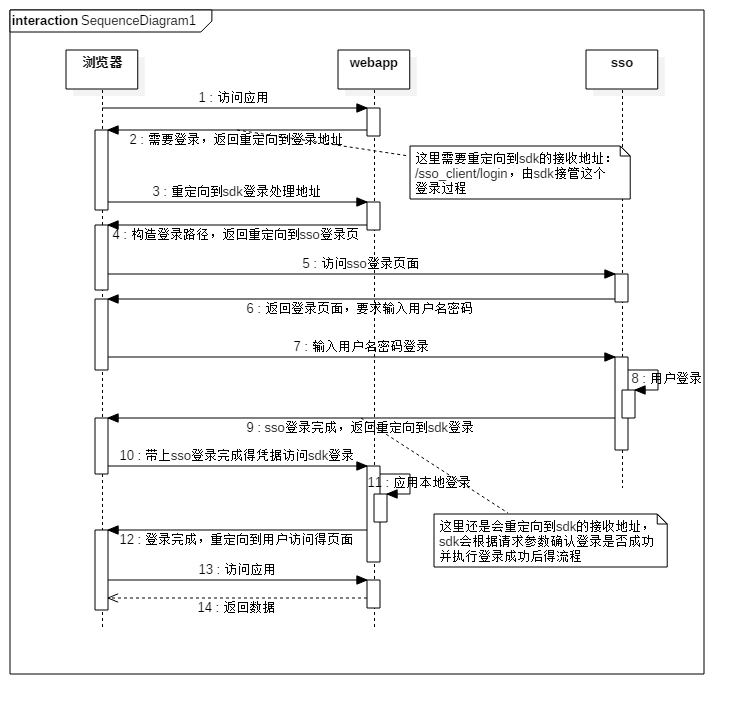

* content
{:toc}

# 前言

这个工程用于品高软件的sso单点登录产品（v3版本）接入的开发sdk，使用这个sdk可以简单方便得接入品高的单点登录服务。

# 安装

* maven安装

如果使用maven构建工程，使用这个sdk只需要添加依赖：

```xml
<dependency>
	<groupId>net.bingosoft</groupId>
	<artifactId>sso-client</artifactId>
	<version>3.1.3-SNAPSHOT</version>
</dependency>
```

* 打包使用

如果不是使用maven安装工程，需要自己打包jar包，这个sdk需要三个外部依赖：

```xml
<dependency>
	<groupId>com.alibaba</groupId>
	<artifactId>fastjson</artifactId>
	<version>1.2.31</version>
</dependency>
<dependency>
	<groupId>org.slf4j</groupId>
	<artifactId>slf4j-api</artifactId>
	<version>1.7.5</version>
	<type>jar</type>
</dependency>
<dependency>
	<groupId>org.slf4j</groupId>
	<artifactId>jcl-over-slf4j</artifactId>
	<version>1.7.5</version>
	<type>jar</type>
</dependency>
```

打包的时候注意要把这几个依赖包也加入到工程依赖中。

下载地址：

* fastjson: [下载](http://repo1.maven.org/maven2/com/alibaba/fastjson/1.2.31/fastjson-1.2.31.jar)
* slf4j: [下载](https://www.slf4j.org/dist/slf4j-1.7.5.zip)

在slf4j的压缩包里，将`slf4j-api-1.7.5.jar`和`jcl-over-slf4j-1.7.5.jar`两个包拷贝到依赖库即可。

> 这里sdk使用的日志是slf4j日志框架，可以使用任何实现该框架的日志实现如log4j或者logback。

# 接入SSO

品高得sso按照[OpenId Connect](http://openid.net/specs/openid-connect-core-1_0.html)实现，需要对该协议有一定了解。

## web端接入

web接入sso的实现流程如下：



从上面的时序图中，我们可以看到，sdk在第3步开始接管应用的登录过程，一直到第12步完成登录后重定向回到应用才结束登录过程。

### 实现本地登录逻辑

在登录流程中第11步可以看到，用户完成在sso的登录之后，会进入本地登录的流程，这个过程主要是sso服务器登录完成之后，用户需要在本地应用保存登录状态，以免下次访问本地应用要重新跳转到sso登录，这里sdk已经将3-10步的流程封装好了，第11步提供了一个抽象类，需要应用自己实现本地登录的逻辑，因此应用需要实现抽象类`bingoee.sso.client.web.servlet.AbstractSignOnServlet`的抽象方法：

```java
/**
 * 用户在sso登录完成后的本地登录操作,这个接口必须实现
 * @param req 登录请求
 * @param resp 登录响应
 * @param it idToken解析的结果，可以从这里获取userId和clientId
 * @param token 本次登录产生的access token，保存下来后可以用于调用其他应用
 */
protected abstract void localLogin(HttpServletRequest req, HttpServletResponse resp, IdToken it, WebAppAccessToken token);
```

示例如下：

```java
package net.bingosoft;

public class LoginServlet extends AbstractSignOnServlet {
    @Override
    protected void localLogin(HttpServletRequest req, HttpServletResponse resp, 
	IdToken it, WebAppAccessToken token) {
        req.getSession().setAttribute("user",new LoginUser(it,token));
    }
}
```

这里假设只要把登录信息设置到`session`的`attribute`中即可完成登录。

这样就完成登录逻辑了，`LoginServlet`这个类将作为处理登录请求的`servlet`。

### 配置sdk的访问路径

处理登录请求的类已经写好了，接下来我们需要配置sdk的访问路径，以便让sdk可以接管登录过程，一般来说，需要在`web.xml`中配置`servlet`来实现sdk接管请求：

```xml
<servlet>
	<servlet-name>login</servlet-name>
	<servlet-class>net.bingosoft.LoginServlet</servlet-class>
	<!-- sso的根路径，不要带/后缀 -->
	<init-param>
		<param-name>sso.endpoint</param-name>
		<param-value>http://host:port/context</param-value>
	</init-param>
	<!-- oauth2 定义的client id -->
	<init-param>
		<param-name>clientId</param-name>
		<param-value>clientId</param-value>
	</init-param>
	<!-- oauth2 定义的client secret -->
	<init-param>
		<param-name>clientSecret</param-name>
		<param-value>clientSecret</param-value>
	</init-param>
</servlet>

<servlet-mapping>
	<servlet-name>login</servlet-name>
	<url-pattern>/sso_client/*</url-pattern>
</servlet-mapping>
```

上面配置了sdk的请求路径是`/sso_client/*`，这表示sdk需要接管所有访问到`/sso_client/`这个路径下的子路径。

> **注意**：这里这个路径不能改变，另外，如果使用的应用有自己的安全拦截器，需要忽略对这个路径的拦截，因为在登录完成前，访问这个路径的请求都是没有用户身份的，如果安全拦截器拦截了这个路径，会导致请求无法被sdk接管，进入无限重定向到登录页面的循环。

这里我们还注意到几个初始化参数的配置：

* sso.endpoint：这个是sso的应用根路径，就是部署sso的地址，不需要/结尾
* clientId：在oauth2规范中，定义了应用身份，包含应用的唯一标识和应用密码，这里需要配置这个应用的应用id作为应用标识
* clientSecret：应用密码

> 应用标识和应用密码是应用的身份凭据，也是sso信任应用的基础，因此应用要接入sso，**需要先在sso申请注册应用**，并获得sso颁发的应用id和应用secret。

### 配置登录页面

一般来说，当我们访问一个web应用的时候，如果用户没有登录，web应用会自动跳转到登录页面，引导用户登录，目前java web应用有很多开源框架可以实现访问安全验证，并自动跳转到登录页面，这时我们需要将自动跳转的登录页面修改为sdk的登录地址，以便让sdk接管这个登录过程。

这里我们用一个简单的拦截器模拟登录校验：

```java
package net.bingosoft;

public class LoginFilter implements Filter {
    @Override
    public void init(FilterConfig filterConfig) throws ServletException {}
    @Override
    public void doFilter(ServletRequest request, ServletResponse response,
                         FilterChain chain) throws IOException, ServletException {
        HttpServletRequest req = (HttpServletRequest)request;
        HttpServletResponse resp = (HttpServletResponse)response;
        
        // 忽略sdk的访问路径
        String url = req.getRequestURI();
        if(url.startsWith(req.getContextPath()+"/sso_client/")){
            chain.doFilter(req,resp);
            return;
        }
        // 判断session中是否有user属性，有则认为已经登录，没有则跳转到登录页面
        Object o = req.getSession().getAttribute("user");
        if(o != null && o instanceof LoginUser){
            chain.doFilter(req,resp);
            return;
        }
        // 跳转到登录页面
        resp.sendRedirect(req.getContextPath()+"/sso_client/login");
    }
    @Override
    public void destroy() {}
}
```

在web.xml中配置如下：

```xml
<filter>
	<filter-name>loginFilter</filter-name>
	<filter-class>net.bingosoft.LoginFilter</filter-class>
</filter>

<filter-mapping>
	<filter-name>loginFilter</filter-name>
	<url-pattern>/*</url-pattern>
</filter-mapping>
```

当一个请求访问应用的时候，如果已经登录，则会自动执行下一步，如果还没有登录（`req.getSession().getAttribute("user")==null`），则会重定向到`/sso_client/login`这个路径，从这里开始将进入第3步，整个登录过程开始由sdk接管。

> 这里使用一个拦截器模拟拦截未登录的请求，实际上无论是使用什么安全框架，都会有跳转到登录页面的过程，这个登录页面的路径有时候是可以配置的，有时候是固定的，如果是可以配置的，直接配置为sdk的登录路径即可，如果是固定的，可以在这个固定的路径的响应中(如jsp页面)再做一次跳转，跳转到sdk登录路径上即可将登录过程交给sdk接管。

### 定制登录成功后的返回页面

从第三步开始，整个登录过程由sdk接管，一直到最后登录完成，默认情况下，登录完成后会自动重定向到web应用的根路径，如果希望登录完成后跳转到自己指定的页面，可以在第三步重定向到sdk登录的时候，增加一个参数`returnUrl`来指定登录完成后跳转的页面，但是这个url必须是经过url编码的值,如：

```
/sso_client/login?returnUrl=https%3A%2F%2Fwww.baidu.com%2F
```

这里`returnUrl`参数的值是`http://www.baidu.com/`的url编码结果，登录完成后会跳转到百度的首页。


### 单点注销

单点登录完成后，需要做单点注销，单点注销的流程在`openId Connect`中并没有定义，因此这里的注销规范是品高的sso注销规范，在单点登录的集成完成后，单点注销只需要访问如下地址：

```
GET /sso_client/oauth2_logout
```

此时sso会将当前设备登录的所有应用都自动注销。

> **注意**：单点注销依赖的是应用在向sso申请注册的时候填写的注销信息，在向sso申请注册应用的时候，需要填写应用的注销地址，在单点注销时，sso会发一个http请求到应用的注销地址实现应用注销。


# 接入品高API网关

如果想要开发rest API并接入品高API网关，需要按照品高API网关的规范接入，品高API网关代理请求时，会代替API进行用户身份校验，并将校验结果以[JWT](http://self-issued.info/docs/draft-ietf-oauth-json-web-token.html)的方式传递给API，此时API作为资源服务器需要校验API确认用户身份。

## 校验JWT

本sdk中提供了对JWT的校验，示例代码如下：

```java
public static void main(String[] args){
	String publicKey = "MIGfMA0GCSqGSIb3DQEBAQUAA4GNADCBiQKBgQDDASOjIWexLpnXiJNJF2pL6NzP\n" +
                "fBoF0tKEr2ttAkJ/7f3uUHhj2NIhQ01Wu9OjHfXjCvQSXMWqqc1+O9G1UwB2Xslb\n" +
                "WNwEZFMwmQdP5VleGbJLR3wOl3IzdggkxBJ1Q9rXUlVtslK/CsMtkwkQEg0eZDH1\n" +
                "VeJXqKBlEhsNckYIGQIDAQAB";
        String jwtToken = "eyJ0eXAiOiJKV1QiLCJhbGciOiJSUzI1NiJ9." +
                "eyJjbGllbnRfaWQiOiJjb25zb2xlIiwidXNlcl9pZCI6IjQ" +
                "zRkU2NDc2LUNEN0ItNDkzQi04MDQ0LUM3RTMxNDlEMDg3Ni" +
                "IsInVzZXJuYW1lIjoiYWRtaW4iLCJzY29wZSI6InBlcm0iL" +
                "CJleHBpcmVzX2luIjoyMzY5NCwiZXhwaXJlcyI6MTQ5MjAw" +
                "Mzc1MjAwMCwiZW5hYmxlZCI6MSwiZXhwIjoxNDkyMDE2MDU" +
                "3MjMyfQ.rig2Y67pkpxxfJxZD9gyKCCwQK5K9bS5w6FcDhn" +
                "kJWc8FEXZEn3kICByb2W9PivouRc5l2_9N4dVXyEH1s2k17" +
                "Jp9aAWU7AFEWwtjdRQe7UIjCxock--FOUzuUKZhrI1tgeVH" +
                "P4p-NNnkh-at43NxEI63HLOKvCo67R3QgK3wrg";
        Authenticator authenticator = AuthenticatorFactory.generateByPublicKey(publicKey);
        Principal principal = authenticator.verifyToken(jwtToken);
}
```

品高API网关的JWT是使用sso的私钥进行签名的，因此需要使用sso公开的公钥进行校验，sdk中有两种方式生成校验器：

```java
// 通过公钥创建校验器
Authenticator authenticator = AuthenticatorFactory.generateByPublicKey(publicKey);
// 通过公钥获取URL创建校验器
Authenticator authenticator = AuthenticatorFactory.generateByPublicKeyUrl(urlString);
```

通过公钥创建校验器适用于公钥已知，并且确定不会变化的情况，创建后即可以进行校验。

公共公钥获取URL创建的校验器适用于公钥未知，但是可以通过http url获取的情况，这种情况校验器在第一次进行校验时，会先通过url获取公钥后再进行校验。

校验器校验的结果是`Principal`对象，这个对象包含了JWT中包含的全部信息，如userId，clientId等，如果校验失败则会抛出异常。

在API接收到网关代理的请求时，如果需要获取用户信息，可以先通过校验器校验JWT并获取用户信息即可。